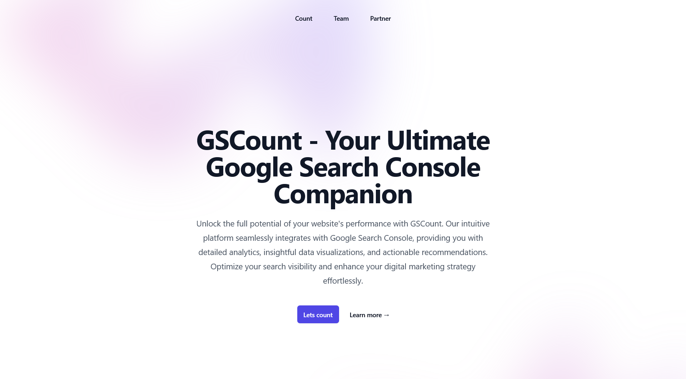
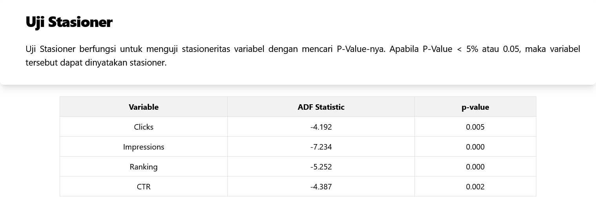
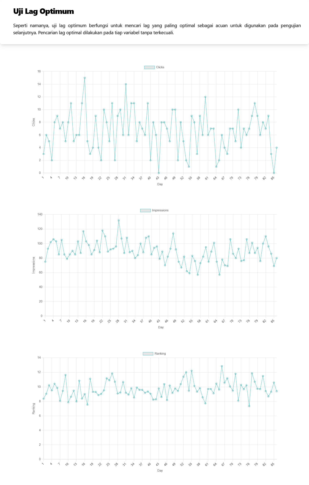
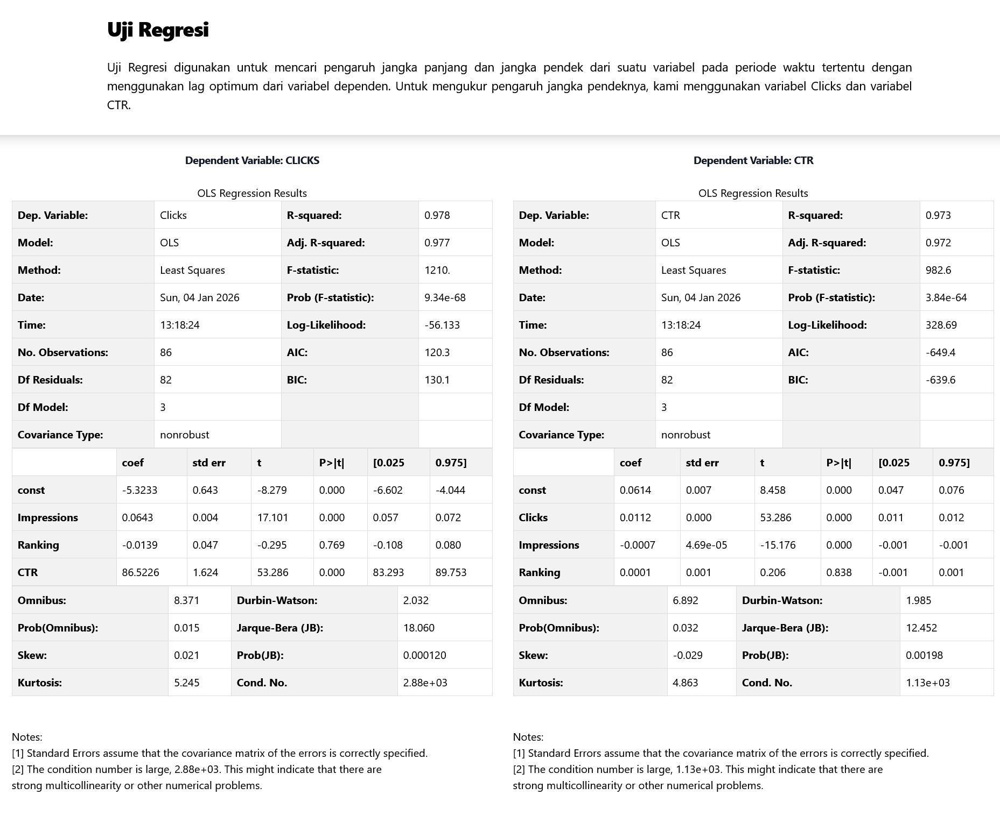
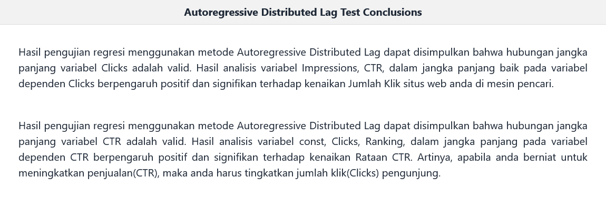

# GSCount - SEO Performance Forecasting Tool

A web-based analytics tool that predicts future SEO performance using Autoregressive Distributed Lag (ARDL) modeling on Google Search Console data.



## 🎯 About This Project

GSCount was developed as my undergraduate thesis project to help website owners and SEO professionals forecast search performance trends. Rather than just displaying historical metrics, it applies time-series econometric modeling to predict future traffic patterns based on 3-6 months of historical data.

**The Problem:** Most SEO tools show you what happened in the past, but don't predict what's coming next. Strategic SEO planning requires understanding future trends, not just historical patterns.

**The Solution:** GSCount uses ARDL (Autoregressive Distributed Lag) statistical modeling - a sophisticated time-series forecasting method - to predict future search performance and identify emerging trends early.

## ✨ Key Features

- **Direct CSV Upload** - Works with Google Search Console export files out of the box
- **ARDL Statistical Modeling** - Applies econometric time-series analysis for accurate forecasting
- **Rapid Analysis** - Generates predictions within seconds of data upload
- **Visual Analytics** - Interactive charts and graphs showing historical trends and forecasts
- **Plain English Summaries** - Automatically generated conclusions that translate complex mathematical results into actionable insights
- **Flexible Time Ranges** - Optimized for 3-6 month analysis periods to capture seasonal patterns

## 🛠️ Technology Stack

- **Backend Framework:** Django (Python)
- **Statistical Analysis:** ARDL time-series modeling
- **Data Processing:** Pandas, NumPy
- **Data Visualization:** Matplotlib
- **Database:** SQLite (development) / PostgreSQL-ready

## 📊 How It Works

1. **Export Data** - Download your Google Search Console performance data as CSV (minimum 3 months recommended)
2. **Upload** - Use the web interface to upload your CSV file
3. **Analysis** - The system automatically processes data using ARDL methodology
4. **Results** - View forecasted performance metrics with:
   - Visual charts showing trends and predictions
   - Statistical diagrams with confidence intervals
   - Plain-language summaries explaining what the numbers mean

## 🚀 Installation & Setup

```bash
# Clone the repository
git clone https://github.com/figopratama/GSCount.git
cd GSCount

# Create a virtual environment
python -m venv venv
source venv/bin/activate  # On Windows: venv\Scripts\activate

# Install dependencies
pip install -r requirements.txt

# Run database migrations
python manage.py migrate

# Start the development server
python manage.py runserver
```

Visit `http://localhost:8000` to access the application.

## 📝 Usage Guide

### Preparing Your Data

1. Go to [Google Search Console](https://search.google.com/search-console)
2. Navigate to Performance → Search Results
3. Set your date range (minimum 3 months, recommended 6 months)
4. Click "Export" → "Download CSV"

### Running Analysis

1. Upload your CSV file through the GSCount interface
2. Wait for processing (typically 5-15 seconds)
3. Review the generated forecasts and insights

## 🧠 What I Learned

This project significantly expanded my technical and analytical capabilities:

- **Time-Series Econometrics** - Implemented ARDL models in a production web application context, understanding the mathematical foundations and practical constraints
- **Real-World Data Challenges** - Handled inconsistent CSV formats, missing data points, and edge cases from Google Search Console exports
- **Django Architecture** - Built efficient data processing pipelines within the Django framework, including file uploads, background processing, and result caching
- **Statistical Communication** - Developed algorithms to translate complex statistical outputs into plain English, making advanced analytics accessible to non-technical users
- **Academic to Production** - Bridged the gap between theoretical thesis research and a functional web application

## 🔬 Technical Deep Dive

### Analysis Methodology

GSCount employs a rigorous three-stage statistical validation process to ensure accurate and reliable forecasts:

#### 1. Stationarity Testing
The first step validates that the time series data meets ARDL model assumptions. Using the **Augmented Dickey-Fuller (ADF) test**, the system checks whether the data is stationary (mean and variance remain constant over time).

- **Why it matters:** Non-stationary data can produce spurious correlations and unreliable forecasts
- **What we test:** Null hypothesis that data contains a unit root (non-stationary)
- **Success criteria:** p-value < 0.05 indicates stationary data suitable for ARDL modeling

#### 2. Lag Optimization
Once stationarity is confirmed, the system determines the optimal number of historical periods (lags) to include in the model.

- **Method:** Compares models with different lag structures using information criteria (AIC/BIC)
- **Why it matters:** Too few lags miss important patterns; too many lags cause overfitting
- **Selection:** Chooses the lag structure with the lowest AIC (Akaike Information Criterion) or BIC (Bayesian Information Criterion)

#### 3. ARDL Regression & Forecasting
The final stage applies the ARDL model with optimized parameters to generate forecasts.

- **Model estimation:** Calculates coefficients for each lagged variable
- **Validation:** Reports R-squared, F-statistics, and coefficient significance
- **Forecasting:** Projects future values with confidence intervals based on historical patterns

This systematic approach ensures statistical reliability, prevents overfitting, and provides defensible forecasts backed by econometric theory.

### Why ARDL Modeling?

Unlike simpler forecasting methods (moving averages, linear regression), ARDL modeling provides:

- **Dynamic Relationships** - Captures both short-term fluctuations and long-term trends in SEO data
- **Lag Structure** - Accounts for the delayed effects of SEO changes (Google's algorithms don't respond instantly)
- **Integration Flexibility** - Handles variables with different levels of stationarity, common in web traffic data
- **Seasonal Patterns** - Identifies and adjusts for recurring patterns in search behavior

### Model Specifications

- **Lag periods:** 3-6 months (optimal for SEO data)
- **Confidence intervals:** 95% (adjustable)
- **Variables analyzed:** Clicks, Impressions, CTR, Average Position
- **Statistical tests:** ADF test for stationarity, AIC/BIC for lag selection
- **Validation metrics:** R-squared, F-statistic, coefficient p-values

## ⚠️ Known Limitations & Design Choices

**Minimal Frontend Styling**
This project prioritizes statistical accuracy and analytical functionality over UI polish. The interface is intentionally stripped down to focus development effort on the core modeling engine. Future iterations would benefit from modern CSS frameworks and responsive design.

**Data Requirements**
- Requires clean CSV exports from Google Search Console
- Best suited for established websites with at least 3 months of consistent data
- Performance may vary for sites with highly volatile traffic patterns

**Processing Constraints**
- Large datasets (>1 million rows) may require extended processing time
- Complex multi-page analysis not yet implemented

## 🚧 Future Improvements

**High Priority:**
- [ ] Responsive UI/UX design with modern CSS framework (Bootstrap/Tailwind)
- [ ] User authentication and project management
- [ ] Save and compare multiple analyses

**Medium Priority:**
- [ ] Support for multiple data sources (Bing Webmaster Tools, Analytics platforms)
- [ ] Comparative analysis across different time periods
- [ ] Export functionality for forecast reports (PDF/Excel)
- [ ] Email notifications for completed analyses

**Long-term Vision:**
- [ ] API integration for automated scheduled analysis
- [ ] Machine learning enhancements for pattern recognition
- [ ] Multi-site portfolio tracking
- [ ] Collaborative features for SEO teams

## 📸 Screenshots

### Upload Interface

*Simple, straightforward file upload for Google Search Console CSV data*

### Analysis Pipeline

The system performs three rigorous statistical tests before generating forecasts:

#### Stationarity Test

*Tests whether the time series data is stationary - a prerequisite for reliable ARDL modeling*

#### Lag Optimum Test

*Determines the optimal number of lag periods to include in the model for maximum predictive accuracy*

#### Regression Test & Forecast

*Final ARDL regression results with forecasted performance trends and confidence intervals*

### Plain-Language Summary

*Automated insights that explain the statistical findings in accessible terms - helping users make decisions without requiring statistical expertise*

## 🤝 Contributing

This is a thesis project, but suggestions and feedback are welcome! Feel free to:
- Open issues for bugs or feature requests
- Submit pull requests with improvements
- Share your experience using the tool

## 📄 License

MIT License - feel free to use this project for learning or adaptation.

## 👤 Author

**Figo Pratama**
- GitHub: [@figopratama](https://github.com/figopratama)
- Project: [GSCount](https://github.com/figopratama/GSCount)

---

*Developed as an undergraduate thesis project in 2024. This tool demonstrates the practical application of econometric modeling to real-world SEO challenges.*